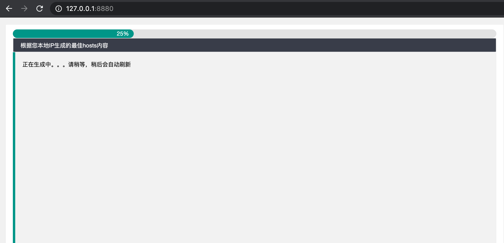
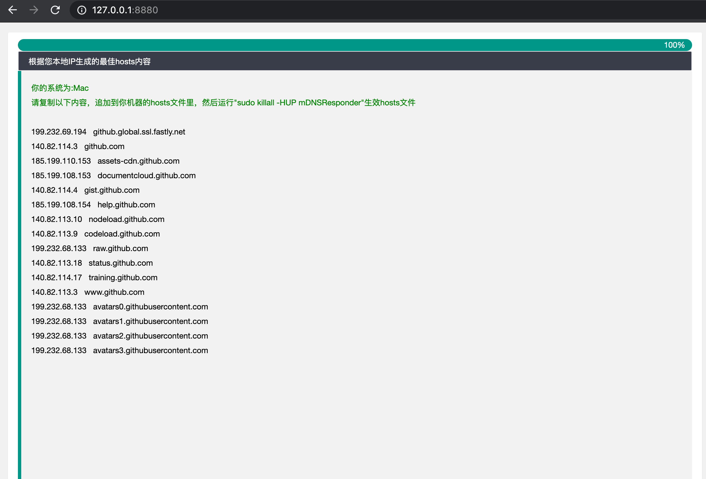

一款自动选取并生成github最快CDN IP的小工具，生成后贴到hosts文件即可

## [下载Jar包](https://gitee.com/bryan31/githubhost/raw/master/bin/githubhost.jar)

## 运行方法
```shell script
java -jar githubhost.jar
```

## 打开浏览器，访问`127.0.0.1:8880`页面





**觉得有用的话，请关注下我的公众号「元人部落」，作者坚持原创的内容技术分享，也有开源作品，欢迎star**

**公众号一般周更，每次会分享一些实用的技术，陪你一起成长**


